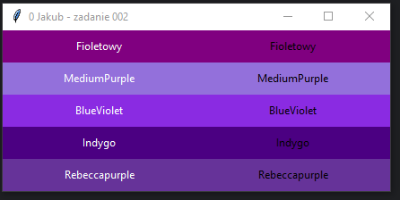

# Zadanie 002

Wykonaj samodzielnie program desktopowy w języku python wykorzystujący bibliotekę tkinter. \
\
Wymagania minimalne:
* okno aplikacji ma tytuł numer z dziennika, imię oraz napis "zadanie 002".
* użyte kolory:
```python
"#800080",  # Purpurowy
"#9370DB",  # MediumPurple
"#8A2BE2",  # BlueViolet
"#4B0082",  # Indygo
"#663399",  # Rebeccapurple
```
Dodatkowo:
* stwórz funkcję 
```python
create_label(row, col, text, fg_color, bg_color)
```
która tworzy etykietę z odpowiednimi parametrami (wiersz, kolumna, tekst, kolor czcionki, kolor tła) i dodaje ją do okna głównego (okno). Użyj funkcji grid() do rozmieszczenia etykiety.
* zdefiniuj listę colors zawierającą pięć różnych odcieni fioletu w formie kodów kolorów.

Uwaga. Kod oraz screen programu umieść w odpowiednim miejscu na classroom. Screen ma zawierać całą zawartość pulpitu.
### Wynik działania programu:
