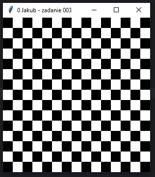

# Zadanie 003

Wykonaj samodzielnie program desktopowy w języku python wykorzystujący bibliotekę tkinter. \
\
Wymagania minimalne:
* okno aplikacji ma tytuł numer z dziennika, imię oraz napis "zadanie 003".
* w pętli zagnieżdżonej, iteruj po wierszach (15 razy) i kolumnach (15 razy) szachownicy.
* dla każdego pola szachownicy, użyj warunku logicznego, aby określić jego kolor. Jeśli suma indeksów wiersza i kolumny jest parzysta, ustaw kolor na "czarny" (pole czarne), w przeciwnym razie ustaw kolor na "biały" (pole białe).
* stwórz etykietę (Label) o szerokości 2 znaków, wysokości 1 znaku i ustaw jej kolor tła (bg)
```python
label = tk.Label(okno, width=2, height=1, bg=color)
```
* użyj funkcji grid() do rozmieszczenia etykiety w oknie głównym (okno) na odpowiednim wierszu (row) i kolumnie (column).

Dodatkowo:
* stwórz funkcję 
```python
draw_chessboard()
```
 która będzie odpowiedzialna za rysowanie szachownicy. Funkcja powinna utworzyć okno główne (okno) i wypełnić je etykietami, które będą reprezentować poszczególne pola szachownicy.

Uwaga. Kod oraz screen programu umieść w odpowiednim miejscu na classroom. Screen ma zawierać całą zawartość pulpitu.
### Wynik działania programu:
