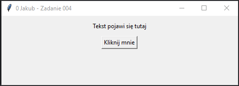

# Zadanie 004

Wykonaj samodzielnie program desktopowy w języku python wykorzystujący bibliotekę tkinter. \
\
Wymagania minimalne:
* okno aplikacji ma tytuł numer z dziennika, imię oraz napis "zadanie 004".
* po uruchomieniu programu użytkownik zobaczy pustą etykietę o treści "Tekst pojawi się tutaj".
* poniżej etykiety znajduje się przycisk z napisem "Kliknij mnie".
* Po kliknięciu przycisku "Kliknij mnie" w etykiecie powinien pojawić się napis "Hello, World!".
* stwórz funkcję poniżej i dodaj jako komendę do przycisku
```python
wyswietl_hello()
```
Uwaga. Kod oraz screen programu umieść w odpowiednim miejscu na classroom. Screen ma zawierać całą zawartość pulpitu.
### Wynik działania programu:



