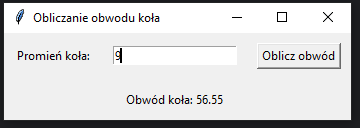

# Zadanie 005

Wykonaj samodzielnie program desktopowy w języku python wykorzystujący bibliotekę tkinter. \
\
Wymagania :
* okno aplikacji ma tytuł numer z dziennika, imię oraz napis "zadanie 005".
* po uruchomieniu programu użytkownik zobaczy etykietę pole oraz przycisk a poniżej wynik działania.
* do obliczeń należy wykorzystać wzór poniżej
```python
Obwód = 2 * pi * r
```
* stwórz funkcję 
```python
oblicz_obwod()
```
 która będzie obliczać według podanego wzoru a wynik umieści w etykiecie "Obwód koła:"
\
\
Uwaga. Kod oraz screen programu umieść w odpowiednim miejscu na classroom. Screen ma zawierać całą zawartość pulpitu.

### Wynik działania programu:



