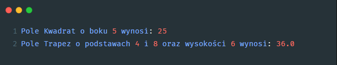

# Zadanie 006

Wykonaj samodzielnie program desktopowy w języku python wykorzystujący bibliotekę tkinter. \
\
Wymagania :
* Stwórz trzy klasy: Figura, Kwadrat i Trapez. 
* Klasa Figura powinna zawierać pole nazwa i metodę oblicz_pole, która jest tylko zdefiniowana, ale nie ma implementacji. 
* Klasa Kwadrat powinna dziedziczyć po klasie Figura i posiadać pole bok oraz implementować metodę oblicz_pole, która oblicza pole kwadratu na podstawie długości boku. 
* Klasa Trapez powinna również dziedziczyć po klasie Figura i posiadać pola podstawa_a, podstawa_b oraz wysokosc, a także implementować metodę oblicz_pole, która oblicza pole trapezu na podstawie długości obu podstaw i wysokości.
\
* Wzór na pole kwadratu
```python
bok ** 2
```
* Wzór na pole trapezu
```python
0.5 * (podstawa_a + podstawa_b) * wysokosc
```
\
Napisz program, który utworzy obiekty klasy Kwadrat i Trapez, obliczy ich pola i wyświetli wyniki.
\
\
Uwaga. Kod oraz screen programu umieść w odpowiednim miejscu na classroom. Screen ma zawierać całą zawartość pulpitu.

### Wynik działania programu:



