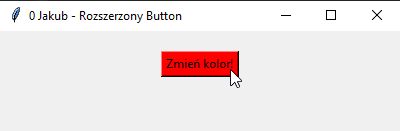

# Zadanie 007

Wykonaj samodzielnie program desktopowy w języku python wykorzystujący bibliotekę tkinter. \
\
Wymagania :
* Klasa RozszerzonyButton na bazie klasy Button z frameworku tkinter, ktory zmienia kolor tła przycisku na czerwony w pomencie najechania kursora myszy na obiekt
\
\
Uwaga. Kod oraz screen programu umieść w odpowiednim miejscu na classroom. Screen ma zawierać całą zawartość pulpitu.

### Wynik działania programu:

