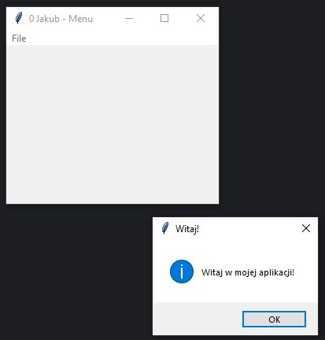

# Zadanie 008

Wykonaj samodzielnie program desktopowy w języku python wykorzystujący bibliotekę tkinter. \
\
Wymagania :
* Twoja aplikacja będzie składać się z dwóch opcji w menu: "Otwórz" i "Zamknij"
* "Otwórz" - Ta opcja powinna otworzyć nowe okno dialogowe (np. MessageBox lub okno modalne) z prostym komunikatem typu "Witaj w mojej aplikacji!". Po kliknięciu przycisku "OK" w oknie dialogowym, komunikat zniknie.
* "Zamknij" - Ta opcja powinna zamknąć aplikację.
* Pomiędzy  "Otwórz" i "Zamknij" będzie separator
\
\
Uwaga. Kod oraz screen programu umieść w odpowiednim miejscu na classroom. Screen ma zawierać całą zawartość pulpitu.

### Wynik działania programu:

