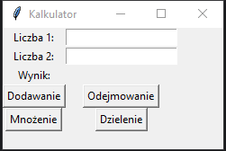

# Zadanie 009

Napisz program w języku Python, który będzie działał jako kalkulator z graficznym interfejsem użytkownika (GUI). Program powinien umożliwiać użytkownikowi wykonywanie podstawowych operacji matematycznych (dodawanie, odejmowanie, mnożenie i dzielenie) na dwóch liczbach. Do stworzenia GUI użyj modułu tkinter.
\
\
Wymagania :
* przyciski do wyboru rodzaju operacji matematycznej (dodawanie, odejmowanie, mnożenie, dzielenie).
* pola do wprowadzenia dwóch liczb, na których użytkownik chce wykonać operację.
* po wprowadzeniu liczb i wyborze operacji program powinien wyświetlić wynik obliczeń na interfejsie.
* program powinien obsługiwać błędy, takie jak próba dzielenia przez zero, i wyświetlać odpowiedni komunikat w przypadku wystąpienia błędu.
* program powinien umożliwiać użytkownikowi wykonywanie wielu operacji matematycznych bez konieczności ponownego uruchamiania.
\
\
Uwaga. Kod oraz screen programu umieść w odpowiednim miejscu na classroom. Screen ma zawierać całą zawartość pulpitu.

### Wynik działania programu:

