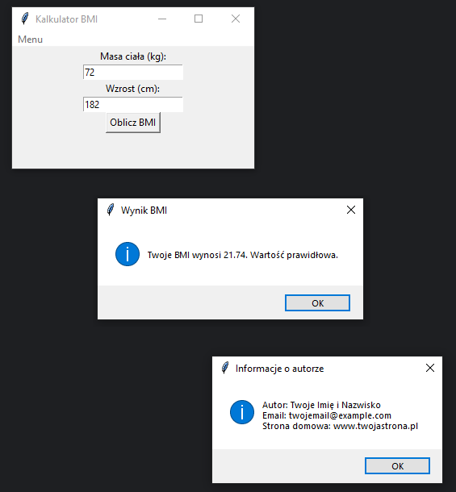

# Zadanie 010

Twoim zadaniem jest stworzenie rozszerzonej wersji kalkulatora BMI w aplikacji desktopowej z wykorzystaniem tkinter. Oprócz samego kalkulatora, aplikacja powinna zawierać menu oraz informację o autorze.\

\
Wymagania :
* program powinien umożliwiać użytkownikowi wprowadzenie masy ciała w kilogramach i wzrostu w centymetrach.
* po podaniu tych danych, program obliczy BMI wg wzoru: BMI = masa (kg) / (wzrost (m) * wzrost (m)).
* program powinien wyświetlić wynik BMI oraz odpowiednią interpretację wyniku (np. "Niedowaga", "Wartość prawidłowa", "Nadwaga", "Otyłość").
* wartości graniczne:\
BMI < 18.5: Niedowaga\
18.5 <= BMI < 24.9: Wartość prawidłowa\
25.0 <= BMI < 29.9: Nadwaga\
BMI >= 30.0: Otyłość\
* menu:

**"Oblicz BMI"** - oblicza BMI na podstawie danych wprowadzonych przez użytkownika.\
**"Informacje o autorze"** - wyświetla informację o autorze programu w oknie dialogowym.\
**"Zamknij"** - zamyka aplikację.\
\
\
Uwaga. Kod oraz screen programu umieść w odpowiednim miejscu na classroom. Screen ma zawierać całą zawartość pulpitu.

### Wynik działania programu:

