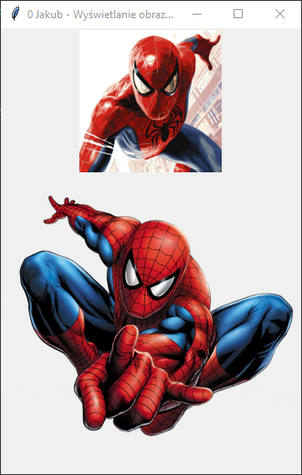

# Zadanie 011

Wykonaj samodzielnie program desktopowy w języku python wykorzystujący bibliotekę tkinter. \
\
Wymagania :
* Wybrany z internetu obraz png oraz jpg ulubionej postaci z kreskówki umieść w oknie jeden pod drugim
\
\
Uwaga. Kod oraz screen programu umieść w odpowiednim miejscu na classroom. Screen ma zawierać całą zawartość pulpitu.

### Wynik działania programu:

