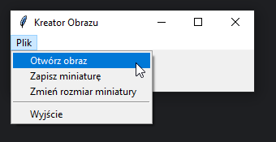

# Zadanie 011

Twoim zadaniem jest stworzenie programu desktopowego w języku Python z wykorzystaniem biblioteki 
tkinter. Program ten pozwoli użytkownikowi na otwieranie obrazów w formatach JPG i PNG,
a następnie umożliwi zapisywanie ich w formie miniatur o wybranych rozmiarach.

### Wymagania :

* Program ma umożliwiać otwieranie obrazów w formatach JPG i PNG. 
Wybór obrazów ma odbywać się za pomocą okna dialogowego.
* Po otwarciu obrazu, program ma automatycznie dostosować rozmiar okna do rozmiaru otwartego obrazu,
jednak szerokość okna nie może być mniejsza niż 300 pikseli.
* Program ma umożliwiać zapisywanie miniatury obrazu o rozmiarach podanych przez użytkownika 
w formacie JPG lub PNG. Użytkownik może wybrać format i lokalizację zapisu.
* Po zapisaniu miniatury, program ma wyświetlić komunikat informacyjny o sukcesie.
* Program powinien obsługiwać błędy związane z otwieraniem obrazów i zapisywaniem miniatur.

### Przykład działania programu:
* Po uruchomieniu programu, użytkownik otwiera obraz w formacie JPG.
* Program dostosowuje rozmiar okna do rozmiaru otwartego obrazu.
* Użytkownik wybiera opcję zapisu miniatury w formacie PNG o rozmiarze np 500x150 pikseli.
* Wybiera zapisz i miniatura zostaje zapisana na dysku, a program wyświetla komunikat o sukcesie.
\
\
Uwaga. Kod oraz screen programu umieść w odpowiednim miejscu na classroom. Screen ma zawierać całą zawartość pulpitu.

### Wynik działania programu:
