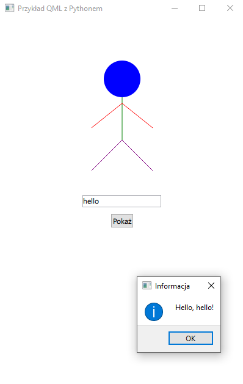

# Zadanie 014

Twoim zadaniem jest rozwinięcie istniejącej aplikacji QML z Pythonem. 

### Aplikacja z przykładu:
* Aplikacja składa się z okna, w którym znajdują się trzy elementy: prosty rysunek ludzika na canvasie, pole tekstowe (TextField) oraz przycisk (Button).

### Wymagania :

#### Minimalne:
* Narysowany ludzik
#### Rozszerzone:
* Dodaj nowy element Canvas, który będzie służył do rysowania prostych figur 3D. Możesz dodać jakieś proste kształty 3D, takie jak sześcian czy walec.
* Dodaj Elementy Interaktywne:
* Dodaj interaktywne elementy do rysunku ludzika. Na przykład, po najechaniu myszką na głowę ludzika, może ona zmieniać kolor.
* Dodaj Pole Tekstowe do Edycji Rysunku:
* Dodaj nowe pole tekstowe, które pozwala użytkownikowi wprowadzać tekst, a następnie użyj tego tekstu do modyfikacji rysunku ludzika.
* Dodaj prostą animację. Na przykład, po naciśnięciu przycisku "Pokaż", może pojawić się animowane mrugnięcie oczami ludzika.

\
Uwaga. Kod oraz screen programu umieść w odpowiednim miejscu na classroom. Screen ma zawierać całą zawartość pulpitu.

### Wynik działania programu:
