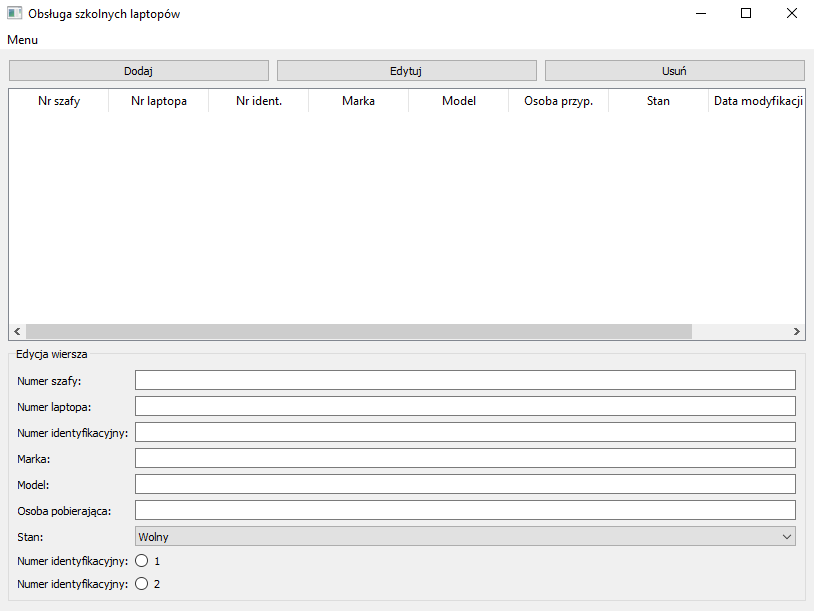

# Zadanie 016

Twoim zadaniem jest wykonanie projektu w Qt Designer. 

### Wymagania :

#### Minimalne:
* Wykonanie projektu UI zgodnie ze zdjęciem
* Dodanie wiersza po wciśnięciu w odpowiedni przycisk
#### Rozszerzone:
* Implementacja wszystkich przycisków
* Stan: Wolny, Zajęty, Nieznany
\
Uwaga. Kod oraz screen programu umieść w odpowiednim miejscu na classroom. Screen ma zawierać całą zawartość pulpitu.
### Pliki nazwij:
* main.py - program Python
* main.ui - projekt z Qt Designer
* screen.png - screen z działaniem programu
* main.exe - program wykonywalny 

#### Na classroom należy przesłać plik imie.nazwisko.zip !

### Wynik działania programu:
